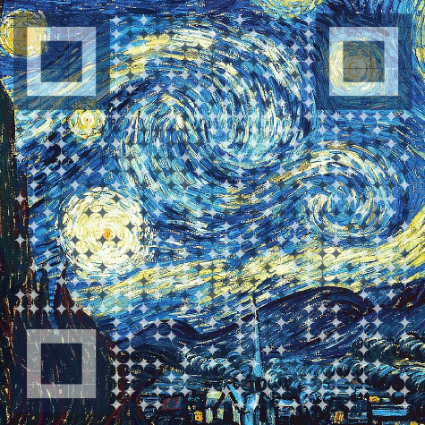

  

### Hi there 👋  
我是一个热衷动手实践、乐于知识分享的技术爱好者。  
目前正深入探索 **AI 与大模型应用 🤖**，并思考它们在实际业务与项目中的落地价值。

---

🌱 **近期在做的事**
- 学习 Prompt Engineering，尝试将 AI 融入日常开发与工作  
- 研究 RAG、Agent 等 AI 技术，并进行一些小型实践  
- ⚡ 热衷于 **n8n**，折腾各种自动化与工作流玩法  

---

💡 **关于我**
- 💻 10+ 年互联网研发 & 架构经验  & 团队管理
- 🛠️ 专注于 **微服务架构、云原生生态与 AI 技术实践**  
- 🎯 喜欢尝试新技术，拥抱变化  

**Skills / Tech Stack**  

 
 
 
 

 

---

## 📊 GitHub Stats

  <!-- 总体统计 - 使用更稳定的服务 -->
  

  <!-- 语言统计 - 使用更稳定的服务 -->
  

  <!-- 访客统计 -->
  

    

      

        👥 总访客数
        
      

    

  

---

🌍 **联系我**

  <!-- X (Twitter) -->
  <a href="https://x.com/MiracleHe" target="_blank">
    

      <svg width="16" height="16" viewBox="0 0 24 24" fill="white" style="vertical-align: middle; margin-right: 8px;">
        <path d="M18.244 2.25h3.308l-7.227 8.26 8.502 11.24H16.17l-5.214-6.817L4.99 21.75H1.68l7.73-8.835L1.254 2.25H8.08l4.713 6.231zm-1.161 17.52h1.833L7.084 4.126H5.117z"/>
      </svg>
      @MiracleHe
    

  </a>
  
  
  <!-- 微信 -->
  
添加微信请备注：github

  
  

---

